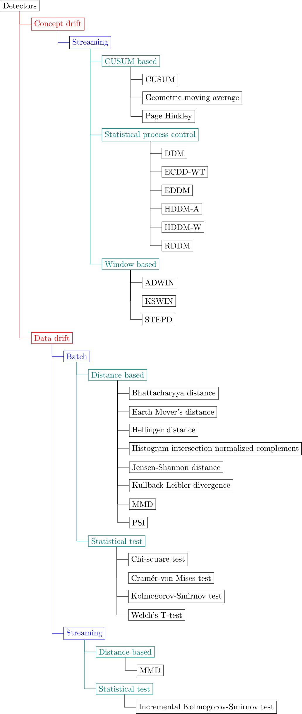
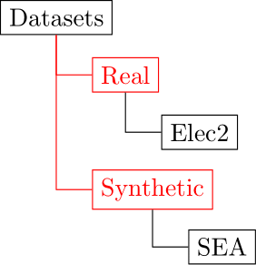

[//]: # (![Frouros logo]&#40;logo.svg&#41;)

<p align="center">
  <!-- CI -->
  <a href="https://github.com/IFCA/frouros/actions/workflows/ci.yml">
    
  </a>
  <!-- Code coverage -->
  <a href="https://codecov.io/gh/IFCA/frouros">
    
  </a>
  <!-- Documentation -->
  <a href="https://frouros.readthedocs.io/">
    
  </a>
  <!-- License -->
  <a href="https://opensource.org/licenses/BSD-3-Clause">
    
  </a>
</p>

<p align="center">Frouros is a Python library for drift detection in Machine Learning problems.</p>

Frouros provides a combination of classical and more recent algorithms for drift detection, both for detecting concept and data drift.

## ⚡️ Quickstart

As a quick and easy example, we can generate two normal distributions in order to use a data drift detector like Kolmogorov-Smirnov. This method tries to verify if generated samples come from the same distribution or not. If they come from different distributions, it means that there is data drift.

```python
import numpy as np
from frouros.detectors.data_drift import KSTest

np.random.seed(31)
# X samples from a normal distribution with mean=2 and std=2
x_mean = 2
x_std = 2
# Y samples a normal distribution with mean=1 and std=2
y_mean = 1
y_std = 2

num_samples = 10000
X_ref = np.random.normal(x_mean, x_std, num_samples)
X_test = np.random.normal(y_mean, y_std, num_samples)

alpha = 0.01  # significance level for the hypothesis test

detector = KSTest()
detector.fit(X=X_ref)
statistic, p_value = detector.compare(X=X_test)

p_value < alpha
>> > True  # Drift detected. We can reject H0, so both samples come from different distributions.
```

More examples can be found [here](https://frouros.readthedocs.io/en/latest/examples.html).

## 🛠 Installation

Frouros supports Python 3.8, 3.9 and 3.10 versions. It can be installed via pip:

```bash
pip install frouros
```

## Drift detection methods

The currently implemented detectors are listed in the following diagram.



## Datasets

Some well-known datasets and synthetic generators are provided and listed in the following diagram.



## 👍 Contributing

Check out the [contribution](https://github.com/IFCA/frouros/blob/main/CONTRIBUTING.md) section.

## 📝 License

Frouros is an open-source software licensed under the [BSD-3-Clause license](https://github.com/IFCA/frouros/blob/main/LICENSE).