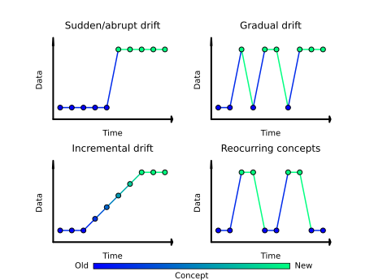

# Concepts

## What is drift detection?

Also known as *change detection* in the literature, can be defined as the process of trying to detect a significant change in the concept previously learned by a model (*concept drift*), a change related to the feature distributions by the model (*covariate drift*), or even a change at a prediction distribution level (*prior drift*).

More formally, the problem statement can be defined as follows:

Given a time period ${[0, t]}$, a set of sample-pairs ${D=\{(X_{0}, y_{0}),...,(X_{t}, y_{t})\}}$, where ${X_{i} \in \mathbb{R}^{m}}$ is the ${m}$-dimensional feature vector and ${y_{i} \in \mathbb{R}^{k}}$ is the ${k}$-class vector (using *one-hot encoding*) if we are dealing with a classification problem or ${y_{i} \in \mathbb{R}}$ is a scalar if it is a regression problem, ${D}$ is used to fit ${\hat{f} \colon X \to Y}$ (known as model) to be as close as possible to the unknown ${{f} \colon X \to Y}$. *Machine learning* algorithms are typically used for this fitting procedure. 
${(X_{i}, y_{i}) \notin D}$ samples obtained in ${[t+1, \infty)}$ and used by ${\hat{f}}$ may start to differ with respect to ${D}$ pairs from a statistical point of view. It is also possible that some changes occur in terms of concept of the problem (change in ${f}$). These cases are considered as a form of drift and can be categorized in the following types:

- **Covariate/feature/data drift**: There is a change in ${P(X)}$ that affects $(P(y|X)$. Therefore, ${P_{[0, t]}(X) \neq P_{[t+1, \infty)}(X)}$. Unsupervised methods are designed to try to detect this drift.

- **Concept/real drift**: There is a change in the conditional probability ${P(y|X)}$ that affects the join probability ${P(X, y)} = {P(y|X)}{P(X)}$, therefore ${P_{[0, t]}(X, y) \neq P_{[t+1, \infty)}(X, y)}$. Supervised methods aim to detect this drift.

- **Prior/target drift**: There is a change in ${P(y)}$, therefore ${P_{[0, t]}(y) \neq P_{[t+1, \infty)}(y)}$. In the context of classification problems it is also known as *label drift*. Unsupervised methods can also be applied to try to detect this type of drift.

- **Virtual drift**: There is a change in ${P(X)}$ but it does not affect \(P(y|X)\).

## Why do I need to use a drift detector?

One of the main mistakes when deploying a Machine Learning model for consumption is to assume that the data used for inference will come from the same distribution as the data on which the model was trained, i.e. that the data will be stationary. It may also be the case that the data use at inference time is still similar to those used for training, but the concept of what was learned in the first instance has changed over time, making the model obsolete in terms of performance.

Drift detectors make it possible to monitor model performance or feature distributions in order to detect significant deviations that can cause model performance decay. By using them it is possible to know when it is necessary to train a model with new data, or even some of these detectors allow to apply an incremental learning to the models.

Frouros is designed to implement the detectors as wrappers over the models trying to add as little overhead as possible. This avoids having to maintain a detector and a model separately. Even if the detector is no longer useful to use at some point, the trained model can be easily extracted, avoiding the need to re-train it.

## Types of drift

### Speed of change




## Verification latency

Also known as *delay*. According to {cite}`dos2016fast`, is defined as the period between a model's prediction and the availability of the ground-truth label (in case of a classification problem) or the target value (in case of a regression problem).
In real-world cases, the *verification latency* is highly dependent on the application domain....in some problems it is no possible to finally obtain the ground-truth/target value, which makes it impossible to detect the concept drift using Supervised methods, therefore other techniques have to be used, such as [Unsupervised Drift Detection methods](#unsupervised).

## Drift detection methods

Drift detection methods can be classified according to the availability of the ground-truth labels at inference time.

### Supervised

Their main objective is to **detect and handle concept drift**. They are closely related to data stream mining, online and incremental learning. 

To use this type of algorithms, labels are supposed to be available for each of the samples at inference time, this make it possible to detect concept drift.

```{important}
`frouros` supports *instance-incremental learning*, but does not yet support *batch-incremental learning*. This means that supervised methods can only be used by one sample at a time.
```

### Unsupervised

On the other hand, there are problems where it is very costly or even impossible to obtain labels, so it is not possible to detect concept drift and the features have to be used to try to determine if some kind of drift is occurring.

### Semi Supervised

It could be considered that there is another type of detector, those that do not require labels throughout the entire process except at specific moments. As for example with the use of an oracle that provides a number of labeled samples at certain times.

```{bibliography} references.bib
:filter: docname in docnames
```